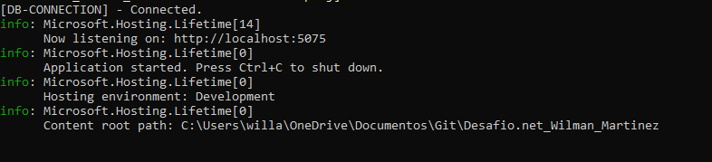
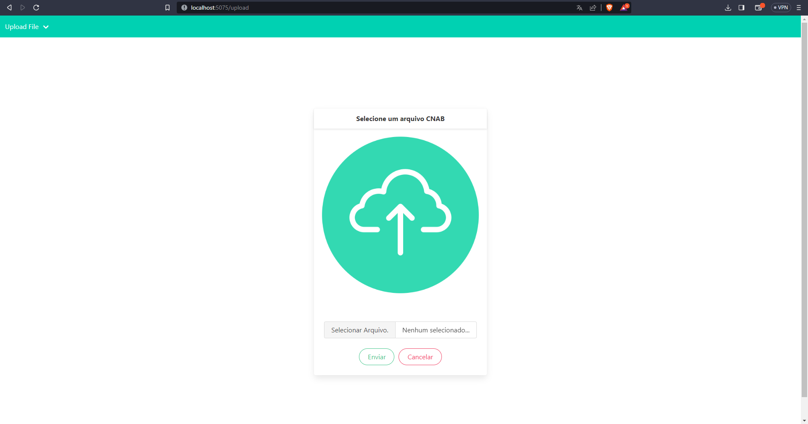
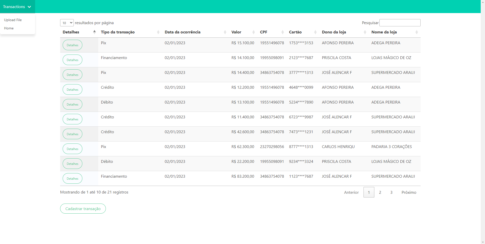
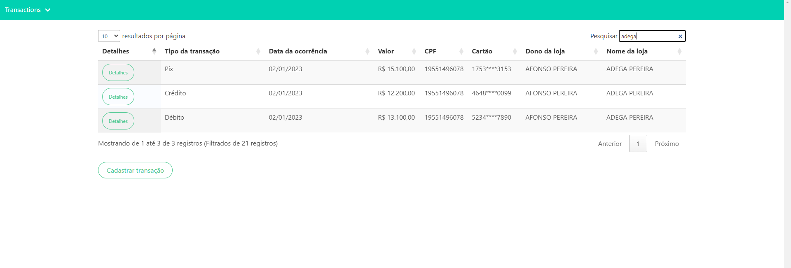
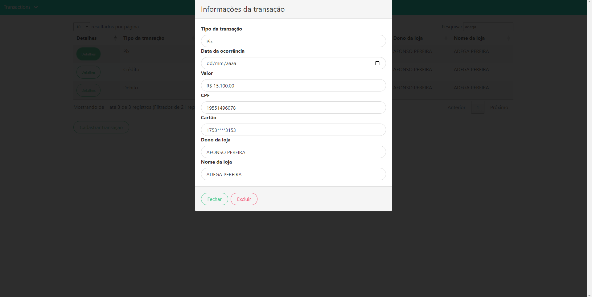

# CNAB_Solution

## Descrição

Este é um projeto de aplicação web que visa atender à demanda de realizar o upload de arquivos no formato cnab, realizar o parse e tratamento dos dados contidos nesses arquivos, e salvá-los em uma base de dados.

## Tecnologias utilizadas

- Aplicação construída usando requisições somente http por conta de praticidade.
- Usado como ferramenta de desenvolvimento o Microsoft Visual Studio 2022 IDE
- Backend desenvolvido em ASP.NET Core (C#), e o frontend foi desenvolvido usando HTML, CSS e JavaScript, com o framework CSS Bulma e jQuery para a utilização do plugin DataTable.
- Foi utilizada a biblioteca gratuita MongoDB.Driver para C# para conectar a aplicação a uma instância local do banco de dados MongoDB.
- Postman foi utilizado para testar a API.

## Requisitos para o funcionamento do projeto

- Para que o projeto funcione localmente, é necessário ter uma instância local do MongoDB rodando. Caso não tenha instalado, você pode acessar o link: [MongoDB Community](https://www.mongodb.com/try/download/community).
- (Opcional) Existem duas opções para conectar-se a uma base de dados local usando o MongoDB: uma é o shell do MongoDB e a outra é uma ferramenta com interface gráfica chamada Compass, que pode ser encontrada nos seguintes links:
    - [MongoShell](https://www.mongodb.com/try/download/community)
    - [MongoCompass](https://www.mongodb.com/pt-br/products/compass)
- É necessário ter o .NET e seu SDK instalados, na versão 6.0 ou mais recente.

## Como iniciar a aplicação

- Faça o clone do repositório para uma pasta local.
- Com o .NET instalado, abra o terminal do Windows ou Linux e acesse a pasta onde o repositório foi clonado.
- Execute o comando "dotnet build" seguido por "dotnet run". Em seguida, o terminal imprimirá mensagens como mostrado abaixo:




## Funcionamento da aplicação

- Criado um menu dropdown do lado esquerdo da tela para navegar entre as views de home, transactions e upload file
- A aplicação possui duas rotas principais:
    - Rota "upload": Nesta rota, o usuário pode selecionar um arquivo cnab para ser tratado e salvo na base de dados.
    - Rota "transactions": Esta view exibe uma tabela dinâmica contendo todas as transações armazenadas no banco de dados, seja através do formulário de cadastro ou do arquivo cnab.
- Além disso, há uma terceira rota chamada "home", mas ela é usada apenas para apresentação do autor.
- 




### Rota "Upload"

Nesta rota, o usuário pode enviar arquivos no formato cnab para salvar suas transações no banco de dados.

### Rota "Transactions"

Nesta rota, estão disponíveis as seguintes funcionalidades:

- **Botão de Detalhes**: Ao clicar neste botão, um modal é aberto, exibindo todos os detalhes da transação realizada.

- **Botão Cadastrar Nova Transação**: Permite o cadastro unitário de uma nova transação sem a necessidade de fazer o upload de um arquivo.

- **Funcionalidades de Filtro na Tabela**: A tabela de transações oferece funcionalidades de filtro, incluindo:
    - Filtro Crescente e Decrescente: Permite ordenar as transações em ordem crescente ou decrescente.
    - Filtro de pesquisa: Permite filtrar qualquer informação na tabela como nome, valor, cpf e vários outros.
    - Paginação: A tabela é paginada, facilitando a navegação entre as transações.
    - Quantidade de Elementos por Página: O usuário pode definir a quantidade de elementos a serem exibidos por página.





### Documentação das API's

- Foi separado as API's de view com as api que tratam os dados no lado do servidor, de forma que a aplicação usa rotas apenas como renderização de arquivo para o frontend e as abaixo para
  tratar os dados necessários.

### POST /api/createTransaction

Cria uma nova transação.

**Parâmetros**

| Nome         | Tipo     | Descrição                    |
|--------------|----------|------------------------------|
| transaction  | Object   | Objeto com os dados da transação a ser criada e informada no corpo da requisição. |

**Resposta**

| Código | Descrição                    |
|--------|------------------------------|
| 200    | Transaction created.|
| 404    | Body request not founded.|
| 500    | Internal server error.|

### DELETE /api/deleteTransaction/{id}

Remove uma transação da base de dados.

**Parâmetros**

| Nome | Tipo     | Descrição                    |
|------|----------|------------------------------|
| id   | string   | id da transação cadastrada na base de dados. |

**Resposta**

| Código | Descrição                    |
|--------|------------------------------|
| 200    | Transaction deleted.|
| 404    | ID value required for transaction deleting.|
| 500    | Internal server error.|

### GET /api/getTransactions

Retorna todas as transações na base de dados.

**Parâmetros**

| Nome   | Tipo     | Descrição                    |
|--------|----------|------------------------------|
| nenhum | nenhum   | API restorna todas as transações sem nenhum filtro sem parametros. |

**Resposta**

| Código | Descrição                    |
|--------|------------------------------|
| 200    | JSON.|
| 404    | Transactions not founded.|
| 500    | Internal server error.|

**Exemplo de resposta**

```json

[
    {
        "id": "64c868581365f9192f3804ca",
        "type": "3",
        "transaction_date": "20230102",
        "amount": "0000015100",
        "cpf": "19551496078",
        "card_number": "1753****3153",
        "store_owner": "AFONSO PEREIRA",
        "store_name": "ADEGA PEREIRA     "
    },
    {
        "id": "64c868581365f9192f3804cb",
        "type": "4",
        "transaction_date": "20230102",
        "amount": "0000014100",
        "cpf": "19955098091",
        "card_number": "2123****7687",
        "store_owner": "PRISCILA COSTA",
        "store_name": "LOJAS MÁGICO DE OZ"
    },
]

```

### POST /api/sendFile

Envia um arquivo de padrão cnab para que seja tratado no lado do servidor e salvar os dados contidos nele.

**Parâmetros**

| Nome | Tipo     | Descrição                    |
|------|----------|------------------------------|
| file |IFormFile | Arquivo selecionado e enviado pelo usuário. |

**Resposta**

| Código | Descrição                    |
|--------|------------------------------|
| 200    | JSON.|
| 404    | CNAB file is required to transations saving.|
| 500    | Internal server error.|

**Exemplo de resposta**

```json

[
    {
        "id": "64c868581365f9192f3804ca",
        "type": "3",
        "transaction_date": "20230102",
        "amount": "0000015100",
        "cpf": "19551496078",
        "card_number": "1753****3153",
        "store_owner": "AFONSO PEREIRA",
        "store_name": "ADEGA PEREIRA     "
    },
    {
        "id": "64c868581365f9192f3804cb",
        "type": "4",
        "transaction_date": "20230102",
        "amount": "0000014100",
        "cpf": "19955098091",
        "card_number": "2123****7687",
        "store_owner": "PRISCILA COSTA",
        "store_name": "LOJAS MÁGICO DE OZ"
    },
]

```

Dessa forma, o projeto atende às necessidades de upload e tratamento de arquivos cnab, além de proporcionar uma visualização clara das transações armazenadas na base de dados MongoDB.
